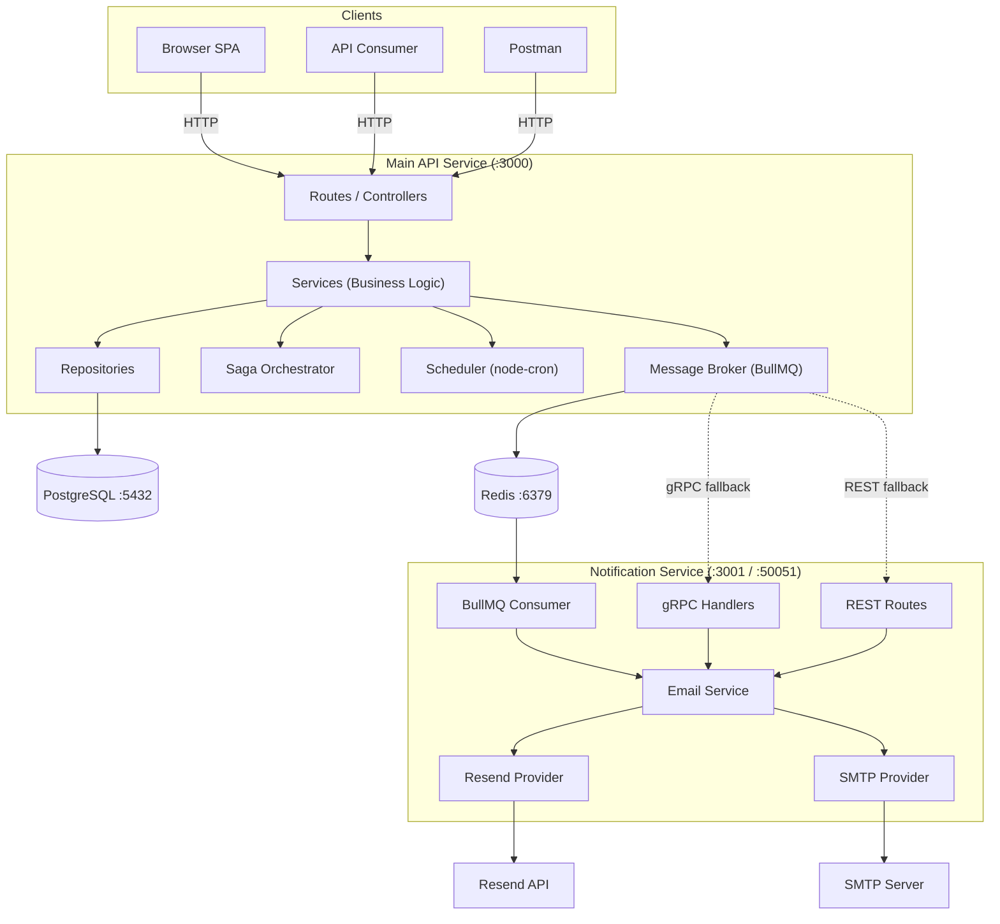
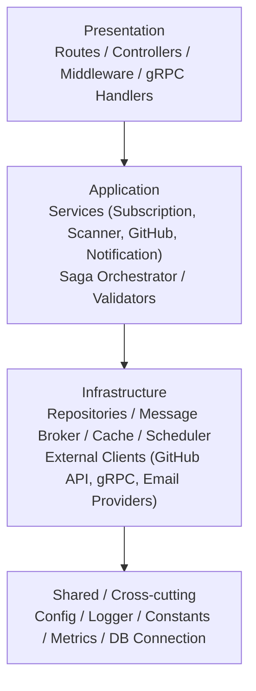
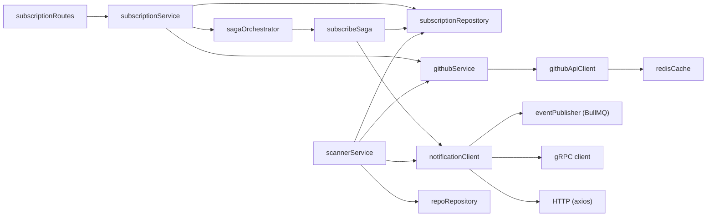
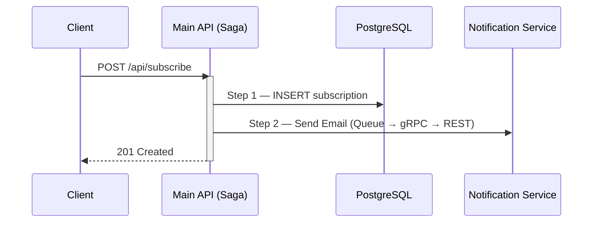
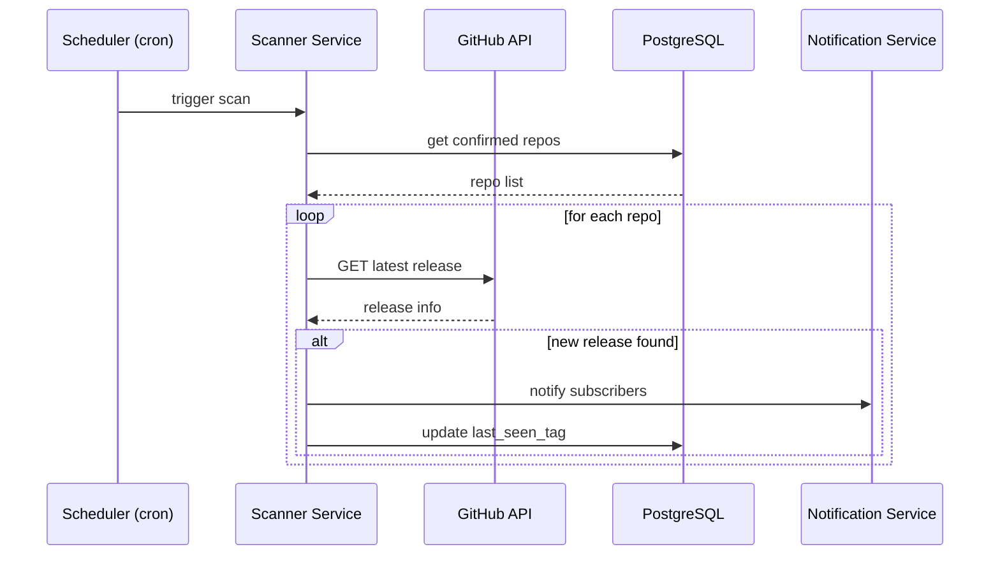
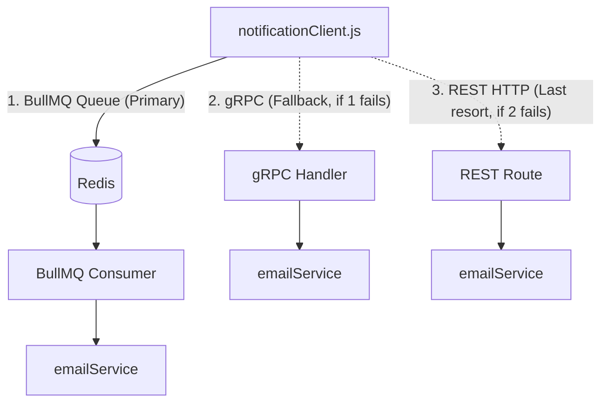
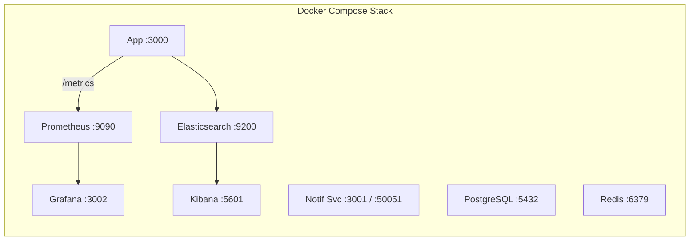

# Architecture: Release Watcher

Release Watcher is a **microservice-based** Node.js application. It consists of a **Main API** service and a **Notification** microservice, connected via three transport paths (BullMQ queue, gRPC, REST fallback).

---

## 1. High-Level Overview



---

## 2. Layered Architecture

The application is built based on the principle of **layered architecture**: each layer can depend only on the layers below it.



### Layer Dependency Rules

| Layer          | May Depend On                       | Must NOT Depend On        |
| -------------- | ----------------------------------- | ------------------------- |
| Presentation   | Application, Infrastructure, Shared | —                         |
| Application    | Infrastructure, Shared              | Presentation              |
| Infrastructure | Shared                              | Presentation, Application |
| Shared         | Nothing (self-contained)            | All other layers          |

---

## 3. Module Structure — Main App

```
src/
├── server.js                          # Entry point (bootstrap)
├── app.js                             # Express application factory
│
├── modules/                           # Feature modules
│   ├── subscription/
│   │   ├── subscriptionRoutes.js      # [Presentation]   HTTP endpoints
│   │   ├── subscriptionService.js     # [Application]    Business logic
│   │   ├── subscriptionRepository.js  # [Infrastructure] DB access
│   │   └── subscriptionValidator.js   # [Application]    Input validation
│   │
│   ├── github/
│   │   ├── githubService.js           # [Application]    Release checking
│   │   └── githubApiClient.js         # [Infrastructure] GitHub API calls
│   │
│   ├── scanner/
│   │   ├── scannerService.js          # [Application]    Scan orchestration
│   │   └── repoRepository.js          # [Infrastructure] Repo DB access
│   │
│   └── notification/
│       └── notificationClient.js      # [Infrastructure] Multi-transport
│
├── infrastructure/
│   ├── saga/
│   │   ├── sagaOrchestrator.js        # [Application]    Saga execution
│   │   ├── subscribeSaga.js           # [Application]    Subscription saga
│   │   └── sagaLog.js                 # [Infrastructure] Saga persistence
│   │
│   ├── messageBroker/
│   │   ├── eventPublisher.js          # [Infrastructure] BullMQ producer
│   │   └── eventTypes.js              # [Shared]         Event constants
│   │
│   └── scheduler.js                   # [Infrastructure] Cron jobs
│
├── grpc/
│   ├── clients/notificationClient.js  # [Infrastructure] gRPC client
│   └── proto.js                       # [Infrastructure] Proto loader
│
├── cache/
│   └── redisCache.js                  # [Infrastructure] Redis cache
│
├── middleware/
│   ├── apiKey.js                      # [Presentation]   Auth middleware
│   ├── metricsMiddleware.js           # [Presentation]   Prometheus
│   └── errorHandler.js                # [Presentation]   Error formatting
│
├── config/index.js                    # [Shared] Environment config
├── db/                                # [Shared] Database connection
├── metrics/index.js                   # [Shared] Metrics registry
├── utils/                             # [Shared] Logger, validation
└── constants/messages.js              # [Shared] Response messages
```

## 3.1 Module Structure — Notification Service

```
services/notification/src/
├── server.js                          # Entry point
├── app.js                             # Express setup
├── config.js                          # [Shared] Environment config
├── logger.js                          # [Shared] Winston logger
│
├── routes/
│   └── notificationRoutes.js          # [Presentation] REST endpoints
│
├── grpc/
│   ├── server.js                      # [Presentation]   gRPC server
│   ├── proto.js                       # [Infrastructure] Proto loader
│   └── handlers/
│       ├── confirmationHandler.js     # [Presentation] Confirmation RPC
│       └── releaseHandler.js          # [Presentation] Release RPC
│
├── consumers/
│   ├── notificationConsumer.js        # [Presentation] BullMQ consumer
│   └── eventTypes.js                  # [Shared] Event constants
│
├── services/
│   └── emailService.js                # [Application] Email logic
│
├── providers/
│   ├── resendProvider.js              # [Infrastructure] Resend API
│   └── smtpProvider.js                # [Infrastructure] SMTP/Nodemailer
│
├── templates/
│   └── emailTemplates.js              # [Shared] Email HTML templates
│
└── utils/
    └── errorDetails.js                # [Shared] Error helpers
```

---

## 4. Dependency Graph Between Modules



---

## 5. Data Flow Diagrams

### 5.1 Subscribe Flow (with Saga)



### 5.2 Release Scanner Flow



### 5.3 Notification Delivery — Multi-Transport Fallback



---

## 6. Infrastructure & Observability



---

## 7. Technology Stack

| Component        | Technology                    | Purpose                     |
| ---------------- | ----------------------------- | --------------------------- |
| Runtime          | Node.js + Express             | HTTP API server             |
| Database         | PostgreSQL 16                 | Persistent storage          |
| Cache / Queue    | Redis 7 + BullMQ              | Caching & async jobs        |
| RPC              | gRPC + Protocol Buffers       | Inter-service communication |
| Email (primary)  | Resend API                    | Transactional email         |
| Email (fallback) | Nodemailer / SMTP             | Email fallback              |
| Scheduler        | node-cron                     | Periodic release scanning   |
| Metrics          | Prometheus + prom-client      | Application metrics         |
| Dashboards       | Grafana                       | Metrics visualization       |
| Logging          | Winston + Elasticsearch       | Structured logging          |
| CI/CD            | GitHub Actions                | Automated testing           |
| Deployment       | Docker + Render               | Containerized deployment    |
| Testing          | Jest + Supertest + Playwright | Unit / Integration / E2E    |

---

## 8. Key Design Decisions

| Decision                        | Rationale                                  | ADR                                                        |
| ------------------------------- | ------------------------------------------ | ---------------------------------------------------------- |
| PostgreSQL as primary datastore | ACID guarantees for subscriptions          | [ADR-001](adrs/ADR-001-postgresql-as-primary-datastore.md) |
| Multi-provider email delivery   | Reliability via Resend + SMTP fallback     | [ADR-002](adrs/ADR-002-email-delivery-strategy.md)         |
| Saga pattern for subscribe      | Atomic multi-step with compensation        | —                                                          |
| Triple transport fallback       | Queue → gRPC → REST ensures delivery       | —                                                          |
| Separate notification service   | Isolation of concerns, independent scaling | —                                                          |
